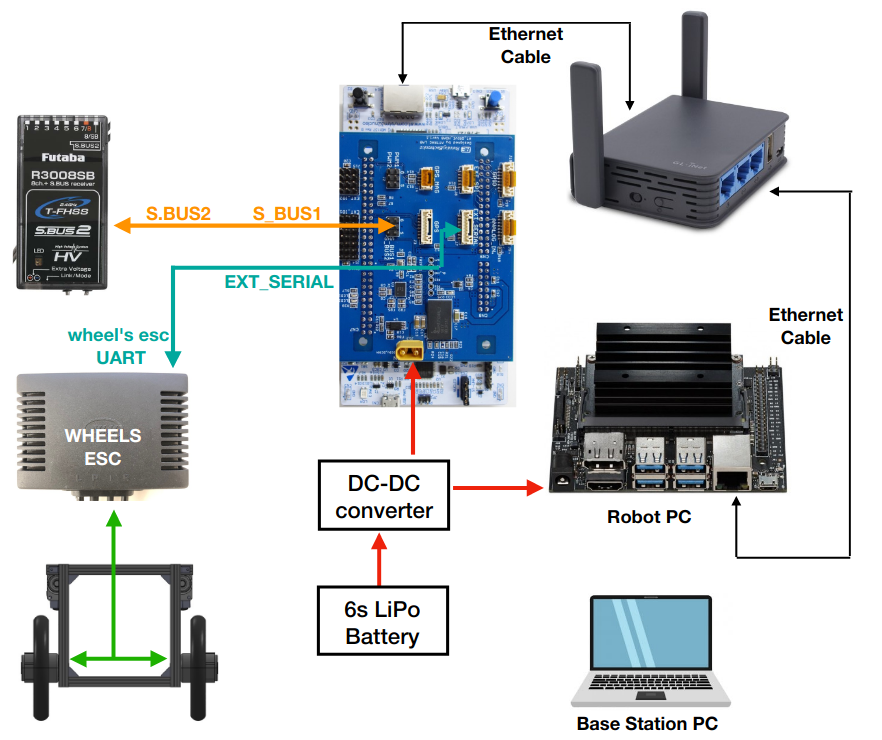
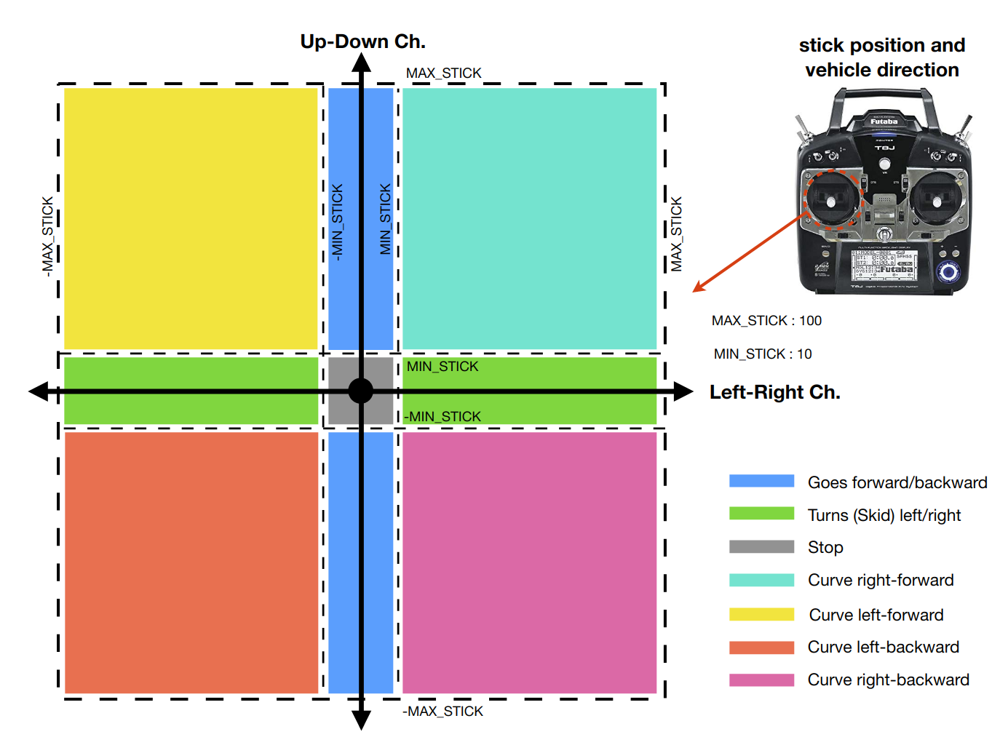
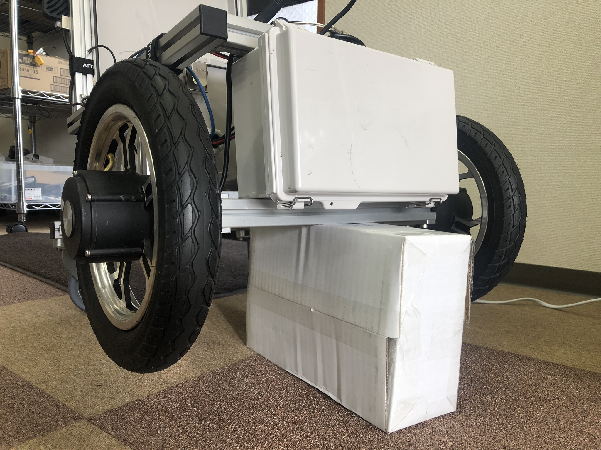

# ATCart-setup

ATCart is ATTRACLAB brushless hub wheels type UGV version 1. It's a differential direct drive system with two of brushless hub wheels, two caster wheels and a chassis. It's designed for high AI adaptability system with the size of human-rideable and general payload for daily task.

This is an explanation of how to setup your ATCart with simple IO components and control your UGV. 

## Checklist
Make sure you have all these hardwares listed below on your ATCart.

1. A cart with two wheels and two caster wheels attached on
2. 6s LiPo battery or something equivalent.
3. Futaba 10J RC transmitter and receiver or something equivalent
4. MOAB board (mbed NUCLEO-F767ZI + IO shield)
5. Wifi router (GL-iNet SLATE)
6. robot PC (Jetson Nano, Intel NUC, etc.)
7. DC-DC converter for your robot PC

Then your hardware setup should look something like this

Normally, everything should be plugged already (except battery), but please make sure again.

## Setup

### Plug Everything
You can plug the battery then check on the electronic parts. After you plug the battery you will hear the "click!" sound from wheel's ESC, that means the ESC is initiliazed and waiting for the command from MOAB board. Make sure eveything turns on and the MOAB's led1 is blinking (we call this heartbeat-led). If you turn on your RC transmitter, your RC receiver should turn to green and you can check on the mbed board there are USER LEDs "red", "green" and "blue" under the shield, which stand for "Stop mode", "Manual mode" and "Auto mode", respectively. If you push on the the left stick (ch2 and ch4), the UGV will move according to this image below.

Make sure your ch5 (should be marked as "E" on propo) is on middle and LED turns green, then you can drive the ATCart around manually.
**NOTE**
You MUST have everything plug on the MOAB (Ethernet cable, wheel's ESC cable, SBUS and power) to make the robot move, otherwise it would be malfunction.

### mbed development and robot IP setting
For more detail on the MOAB firmware, I highly recommend you to check on [this github repo](https://github.com/rasheeddo/atdrive-moab/tree/master), this is the ATCart version from the original of [Mark Fassler's repo](https://github.com/mfassler/atdrive-moab). The code is written on mbed-os for the STM32 NUCLEO-F767ZI, the language is c++. If you want to modify the code, play around with the GPIO pins, compile and flash the code, please check on [this mbed site](https://os.mbed.com/docs/mbed-os/v5.15/tools/index.html). I am using Linux Ubuntu 16.04 and developing the code from Mbed CLI, but you can use Mbed Studio or Mbed Online Compiler as you want.

After you install mbed environment on your machine, then you may need to change something on the `ROBOT_CONFIG_XDRIVE_GLiNet.hpp` file, so open it then change the line that say `#define _AUTOPILOT_IP_ADDRESS "192.168.8.162"` to your robot PC ip address. This is important because the MOAB will communicate with robot PC from this ip address, so you MUST change it according to your robot PC. Then if you are using Mbed CLI, open new terminal on the atdrive-moab directory, then compile with this command `mbed compile -m NUCLEO_F767ZI -t GCC_ARM`. Note that I am using a toolchain as `GCC_ARM`. Then you can flash the firmware with `mbed compile -f` . You can set the default toolchain and target board for this atdrive-moab code because we always use this board for development, please check how to complile and set those toolchain and target boarad from [here](https://os.mbed.com/docs/mbed-os/v5.15/tools/compile.html).

Every time you flash the new firmware to the board, you MUST reset the board by pushing "RESET B2" botton (black botton) on the MOAB board. You will hear the "click!" sound same as time first time, so that should be fine.

### Testing Auto Mode
I think you should have no problem with the manual mode control from the RC transmitter, then we are going to test sending some command from the robot PC to the MOAB board. Before doing that let find something to lift the UGV up, so the wheel won't touch to the gound. This is just for safety to prevent the UGV to go with full speed with uncontrolable, so find some box or anything underneath the UGV to let it spins freely on the air.

Generally, I will put the code on both robot and base station PCs, so both will have same code to run and you can edit the code on your base station PC (your laptop) and copy it to robot PC via ssh. First let's try copy this ATCart-setup directory into your robot PC by using secure shell copy. If you clone this repo to your home or Desktop directories, then just go there and open the new terminal from there, then on terminal just hit this command `scp -r ATCart-setup/ nvidia@192.168.8.162:/home/nvidia/`. Note that I am using NVIDIA Jetson Nano for my robot PC and its ip is `192.168.8.162`, so you have to change this according to your robot PC. Then we can ssh into the robot ip by `ssh nvidia@192.168.8.162`, it may ask you some permission just type `y` and enter there. So now you can run the script on the robot PC from your base station PC with this terminal. This is just a linux style of file transfer via ssh, you can use any software as you want.

Then there is a python script `testUDP.py` , open that file on your PC with your favorite editor and you will see a simple script how to send a UDP packet to MOAB via Ethernet. Make sure that line 15 `MOAB_COMPUTER = "192.168.8.20"` is a correct ip for the MOAB board. We can simply confirm with the `ROBOT_CONFIG_XDRIVE_GLiNet.hpp` file at the first line, this should be same ip. The port we use to send the rpm values is `MOAB_PORT = 12346` at line 16. If you are not familiar with python [socket](https://docs.python.org/3/library/socket.html) and [struct](https://docs.python.org/2/library/struct.html) please check on this documentation on how to use it, because we are going to use this a lot for a lot of autopilot application. Then you will there is a `while True:` loop to run the command because we are going to send the command continuously to the robot, `testSendFloat(rpmR,rpmL)` is a function we use to send the rpm of right and left wheels to the MOAB, please try change the value in there and see the result. Make sure that your ch5 of the transmitter is on "auto-mode" with "blue" LED on. When you kill the programm or it crashs or network was gone for some reason the MOAB will stop the command immediately for safety. Please try simulate those situation to make you feel comfortable to use it, try to get use to it before running complicated stuff. Note that if you change something on your base station PC, you HAVE TO copy it to the robot PC so from ATCart-setup directory open new terminal and hit this command `scp testUDP.py nvidia@192.168.8.162:/nvidia/home/ATCart-setup/`.

### Tools
We have a testing tool for the MOAB which developed from Mark Fassler [here](https://github.com/mfassler/atdrive-moab-tools), I recommend to clone it to your robot and base station PCs. You can see testing_tools directory just go there, then we are going to test receive the sbus value and print out to the screen terminal. So we will run `host_sbus_listener.py` on robot PC via ssh from our base station PC. You should see the all of the sbus value printing out on terminal, if you try switch each channel arround and move the stick you will see the value change. This is one of the tool we can use for debugging our system.